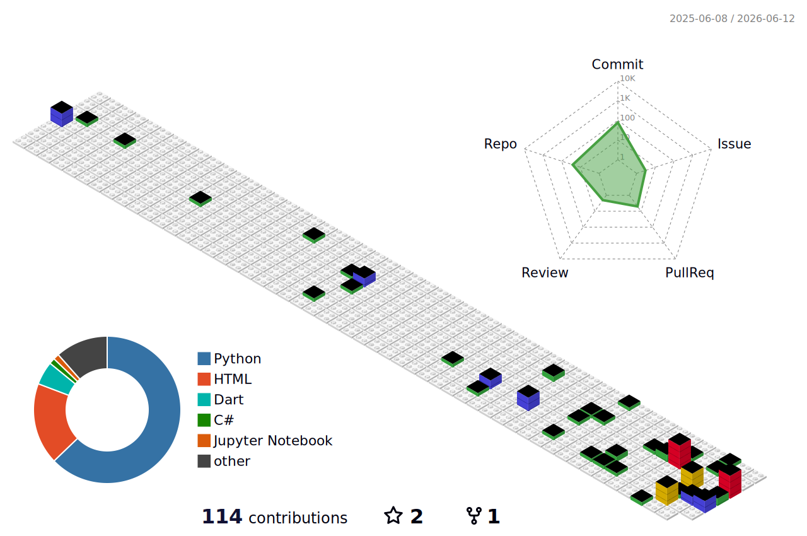

# Hey, I'm Marco Antonio 🚀

<h3 align="center">Process Automation | Web Applications | GeoDev | Passionate about AI 🤖</h3>

---

## 🧩 About Me

<table>
  <tr>
    <td width="60%">

I'm a developer focused on **automation, back-end, artificial intelligence, and web applications**.

I love building solutions that transform manual workflows into **smart, automated systems**, integrating **APIs, databases, and user-friendly interfaces**.

I’m also very interested in the **GeoDev ecosystem**, working with **geospatial solutions**, **PostGIS**, and tools that connect software development with **maps, spatial data, and geographic analysis**.

### What I enjoy working with:
- 🐍 Building robust solutions with **Python**
- 🌐 Creating **web applications** with **Django**, **Flask**, **HTML**, **CSS**, and **JavaScript**
- 🗺️ Exploring **GeoDev**, **geospatial systems**, and **PostGIS**
- ⚙️ Automating tasks with **PyAutoGUI**, **Selenium**, **Playwright**, and custom scripts
- 🔌 Integrating systems, APIs, and external tools
- 🧠 Studying **AI Agents, LLMs, RAG**, and generative AI applications
- 🚀 Designing solutions that connect **automation + AI + data + web**

</td>
<td width="40%" align="center">
  
</td>
  </tr>
</table>

---

## 💼 Tech Stack

### Main Technologies

  

### Automation, AI & Integrations
- ⚙️ **PyAutoGUI**
- 🎭 **Playwright**
- 🤖 **OpenAI / LLM workflows**
- 🔌 **MCP (Model Context Protocol)**
- 🔄 API integrations and intelligent pipelines

### GeoDev & Spatial Data
- 🗺️ **GeoDev**
- 🛰️ **PostGIS**
- 🌍 Spatial databases and geographic workflows
- 📌 Interest in mapping, geospatial analysis, and location-based applications

> **Note:** Some technologies I use regularly, such as **Playwright**, **MCP**, and **PostGIS**, may not appear in Skill Icons, but they are part of my current stack.

---

## 📚 Currently Learning

- 🤖 Autonomous AI agents and LLM pipelines
- 🧠 Retrieval-Augmented Generation (**RAG**)
- 🔌 **MCP (Model Context Protocol)** and tool integrations
- 🌿 **Git worktrees** and **subagents** for more efficient development workflows
- 🌐 Scalable and modern **web application architecture**
- 🗺️ **GeoDev**, geospatial workflows, and **PostGIS**
- 🔄 Asynchronous integrations and reactive architectures
- 🧼 Clean Code and Python best practices

---

## 📊 GitHub Analytics

  

---

## 📈 Contribution Activity

  

---

## 🧊 3D Contributions

  

> A 3D view of my GitHub contribution activity.

---

## 📫 Contact

- ✉️ Email: **[2msoftware.tecnologia@gmail.com](mailto:2msoftware.tecnologia@gmail.com)**

---

## 💭 Quote

### 🧠 *"Code is creativity in the form of logic."*

